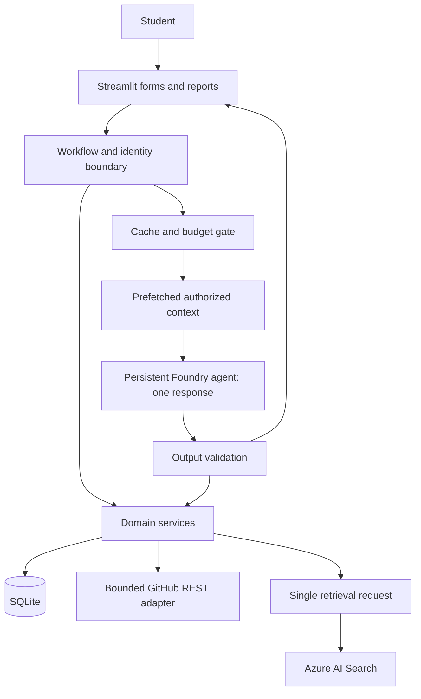
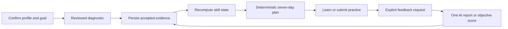
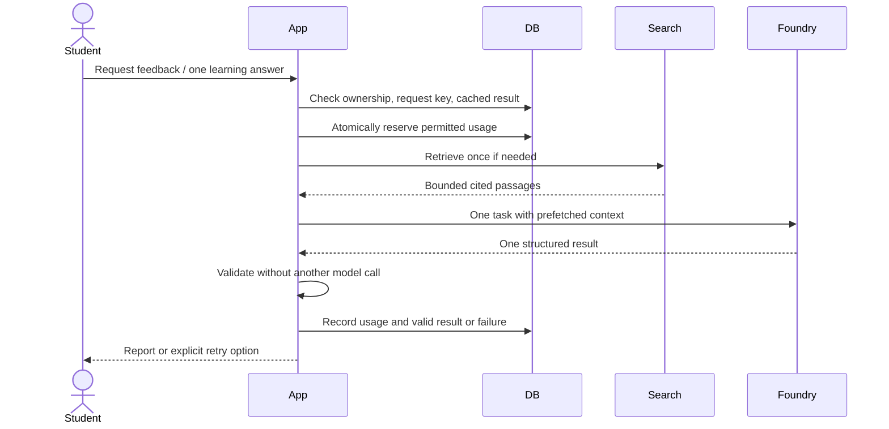
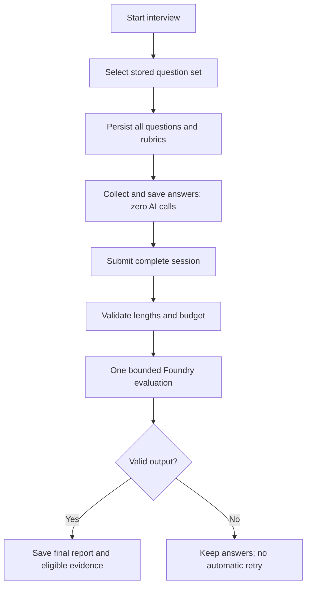

# Architecture

## Boundaries

LLM: extraction drafts, grounded explanations, one-shot feedback, optional batch project questions. Deterministic application: identity, workflow, retrieval preparation, scoring keys, evidence aggregation, plan feasibility, budget checks, persistence. External adapters: Foundry, Search/embeddings, GitHub. Database: authoritative student state. RAG: approved educational passages only.

## User and feedback flow

## Credit-conscious AI action

## Fixed interview flow

## Components

| Component | Purpose/responsibility | Inputs → outputs | Dependencies/technology |
|---|---|---|---|
| UI | Structured forms, session resume, reports | Actions → commands/views | Streamlit/services |
| Identity | Authoritative student scope | Verified subject → student context | Auth boundary/repositories |
| Workflow | Legal transitions and explicit AI actions | Command/state → operations | Python |
| Profile/documents | Parse, draft, confirm facts | PDF/text → confirmed versioned facts | Parser/Pydantic/Foundry |
| GitHub | Bounded evidence snapshots | Approved repo → commit/path excerpts | REST client |
| Assessment | Frozen questions and objective scoring | Goal/answers → results | Reviewed catalog/SQLite |
| Evaluation | One-shot rubric feedback | Bounded submission → valid/pending result | Foundry/validators |
| Student state | Derive skill summaries | Accepted evidence → state/history | Deterministic policies |
| Planning | Eligibility, priorities, scheduling | Goal/state/capacity → feasible plan | Catalog/prerequisites |
| Interview | Fixed sessions, batch final evaluation | Question set/answers → report | State machine/evaluator |
| Retrieval | Educational grounding | Query/filters → passages | Search/embeddings |
| Budget | Admission, deduplication, usage tracking | AI action → permit/deny | SQLite/config |
| Persistence | Ownership, transactions, migrations | Validated data → durable records | SQLAlchemy/Alembic |
| Telemetry | Sanitized usage/failure metrics | Run events → redacted records | Logs/optional Azure telemetry |

## Failure rules

Persist answers before AI access. Provider failures leave attempts intact and evaluations pending. No automatic AI retry, repair, or self-critique call. Search failure yields no fabricated citations. Invalid/stale outputs do not change state. Duplicate submissions return saved results. GitHub outages show dated snapshots. Database failures roll back related local updates.
