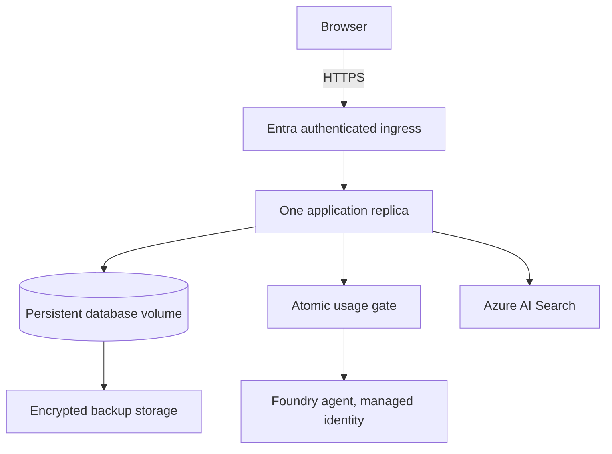

# Deployment, security, privacy, and cost controls

## Supported release boundary

The release supports a local single-user mode and a hosted single-replica mode. Hosted startup requires `AUTH_MODE=azure_easy_auth`; the application derives an opaque student identifier from Azure's authenticated `X-MS-CLIENT-PRINCIPAL-ID` header and fails closed when the header is absent. The hosting boundary must reject unauthenticated traffic before it reaches Streamlit and must strip client-supplied identity headers.

The supported hosted demo uses Microsoft Entra authentication at Azure ingress, HTTPS, one application replica, and a persistent Azure Files mount for SQLite. Multi-instance hosting requires PostgreSQL and object storage rather than shared-network SQLite.

## Deployed v0.1.0 resources

The verified showcase deployment uses:

- Container app: `placement-prep-agent-prod`
- URL: `https://placement-prep-agent-prod.proudtree-dd527a5a.uaenorth.azurecontainerapps.io/`
- Environment: `placement-prep-standard-7495`, workload-profiles Consumption
- Scale: zero minimum, one maximum replica, single revision mode
- Persistent share: `placementdata7495/placementdata`, mounted at `/app/data/private`
- Image: `caa940191ac5acr.azurecr.io/placement-preparation-agent:latest`
- Search: `placementprepsearch7495`, index `placement-knowledge-v1`, corpus `starter-v1`
- Foundry project: `vidhi2915beai24-9925`, agent `placement-preparation-agent:4`

The container app pulls from ACR with its system-assigned managed identity. Its runtime identity has `AcrPull`, `Search Index Data Reader`, `Cognitive Services OpenAI User`, and project-scoped `Foundry User`. Entra Easy Auth is tenant-only, requires HTTPS, and redirects anonymous clients to Microsoft sign-in.

Live limits are `6000` input tokens, `1000` output tokens, `15000` student tokens/day, `50000` project tokens/day, five interview questions, and 12000 answer characters. Application code performs no automatic chat-model retry.

## Local container release

Build and run the reproducible image without live Azure calls:

```powershell
docker compose build
docker compose up -d
docker compose ps
```

Open `http://127.0.0.1:8501`. Docker checks `/_stcore/health` every 30 seconds. Inspect with `docker inspect --format '{{json .State.Health}}' placement-preparation-agent-app-1` and stop with `docker compose down`. The named `placement-data` volume preserves SQLite data across container replacement. `docker compose down -v` permanently removes it and is only appropriate after a verified backup.

For local live-AI validation, pass an environment file containing only non-secret settings and authenticate with a developer identity outside the image. Never copy Azure credentials into the image or repository. Production should use managed identity. The container runs as unprivileged user `10001` and excludes local databases, logs, backups, and `.env` files from its build context.

## Azure deployment gate

The image is suitable for a private Azure Container Apps demo only after ingress authentication is enabled and anonymous requests receive 401/redirect before application code. Use:



Required release checks are: authenticated subject derived server-side; one application replica; persistent storage mounted at `/app/data/private`; Foundry/Search roles granted to managed identity only; agent and corpus versions pinned; health probe configured; live call limits configured; encrypted backups tested; no secrets in image or environment export; and teardown commands reviewed. Verify current region support and price before provisioning any paid resource.

## Privacy and retention

The app stores profiles, resume/job-description text, public repository snapshots, answers, evaluations, plans, events, and usage reservations in SQLite. Export and deletion are explicit student actions. Local deletion removes that student's application rows; it does not claim to remove Azure provider telemetry or historical backups. Document provider retention separately before a public launch.

For a showcase, use synthetic student data and approved public repositories. Keep backups only for the showcase/recovery window, encrypt them at rest, restrict their readers, and expire old backups on a documented schedule. A restored backup may contain a student deleted after it was created; reapply deletion records before reopening access in a real hosted system.

## Cost controls

Azure budget alerts monitor spend but do not stop requests. The application additionally reserves per-action, per-student, and project usage before dispatch, performs no automatic model retry, and uses one-shot feedback. Search and hosting may incur costs even with no model responses; remove unused paid resources after the showcase.

The project budget is INR 10,000, with an INR 1,500 development/test operating cap. Search uses the Free tier; Container Apps scales to zero; the Azure Files share is capped at 1 GiB; ACR uses Basic; and Foundry/model usage is pay-per-use. Review Azure Cost Management before and after each showcase.

## Verified release checks

- Anonymous HTTPS request returned `302` to the tenant's Microsoft login endpoint.
- The app accepted the authenticated principal only from Easy Auth headers.
- A marker written under `/app/data/private` remained after the container replica restarted.
- The active deployment is healthy, single-revision, and limited to one replica.
- Managed identity read pinned agent `placement-preparation-agent:4` and model `gpt-4.1-mini`.
- One bounded Foundry request completed with 280 total tokens, no tools, and no retries.
- Hosted retrieval completed one embedding request and one Search request and returned approved `starter-v1` citations.
- No credential is stored in the image or repository.

## Rollback and teardown

Before replacing an image, create and verify a database backup. Keep the last known-good image tag and schema-compatible backup. Roll back by stopping the app, restoring the backup as described in [recovery.md](recovery.md), starting the previous image, and checking the health endpoint plus a read-only student view.

Teardown order: disable live AI, take the final export/backup, stop compute, confirm retention requirements, remove Search/Foundry/compute resources that are no longer needed, and finally remove local persistent storage. Never remove the only verified backup during teardown.
