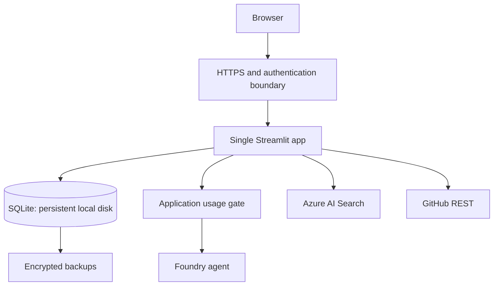

# Deployment, security, privacy, and costs

## Deployment progression

Develop locally with SQLite and live Azure services only for explicit tests. Hosted MVP: one Linux VM/application instance, SQLite on persistent local storage, HTTPS, verified authentication, managed identity, encrypted backups. Future multi-instance hosting requires PostgreSQL first. No shared-network SQLite or ephemeral database image layer.

Resources: Foundry project/agent, chat/embedding deployments, Search, application compute/identity, optional Blob backup and Application Insights. Verify current regional compatibility and prices before provisioning. Search/hosting may cost money when there are no chat turns.

## Security

Derive student identity server-side. Enforce ownership at every repository/service boundary; unverified headers and browser IDs are not authorization. Treat documents/repo text as untrusted data. Bound uploads and API files, validate GitHub URLs, prevent arbitrary network targets, never execute user/repository code, and keep answer keys out of tutoring retrieval.

Redact secrets and private content from logs. Cache private results by student and immutable input/version. Validate generated evidence/citation IDs. Give Azure identities only required permissions. Local demo identity must not be enabled on a public deployment.

## Retention and deletion

Proposed defaults: delete raw resumes after confirmed extraction unless retention is requested; retain necessary confirmed evidence while account is active; expire optional inactive conversation context after 30 days; keep operational logs bounded and redacted. Final policy is implemented and documented in P25.

Export/delete requires an explicit authorized action. Track local files/database rows, remote conversations, caches, and backup-retention implications separately. Failed cloud deletion stays visible/retryable. Restore procedures reapply deletion records before reopening access. Do not claim all remote data vanished just because local rows were deleted.

## Budget controls

Configure project and per-student limits before enabling live calls; reserve usage atomically; bound input/output, questions, and answers; disable automatic model retries; reuse valid feedback; hash-cache embeddings; reuse repository snapshots. Usage estimates must state rate/version assumptions and reconcile with provider usage when available. Billing alerts are monitoring, not a guaranteed hard stop.

## Release checks

Authentication cannot be bypassed; restart preserves state; no secrets in image/repository; pinned agent/corpus versions; one host only; backup/restore verified; compatible rollback documented; resource teardown documented. Do not claim production-scale availability for a single-VM demo.
